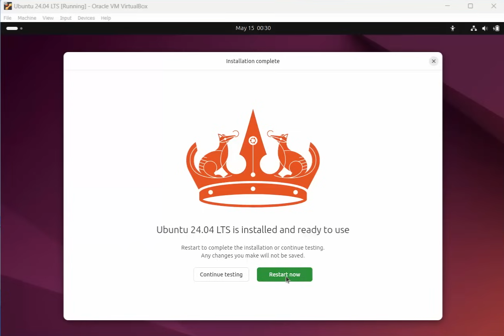

# Assignment 0 – Install Linux (Ubuntu)

# 🚀 Install Ubuntu on VirtualBox

This guide will walk you through installing **Ubuntu** on **Oracle VirtualBox** step by step.  
Perfect for beginners setting up a Linux environment inside Windows or macOS.

---

## 📦 Prerequisites

Before starting, make sure you have:

- [Oracle VirtualBox](https://www.virtualbox.org/) installed  
- Ubuntu ISO file (download from [Ubuntu Downloads](https://ubuntu.com/download/desktop))  
- At least **4 GB RAM** and **25 GB free disk space**  

---

## ⚙️ Step 1: Create a New Virtual Machine

1. Open **VirtualBox**  
2. Click **New**  
3. Enter a name, e.g., `Ubuntu-VM`  
4. Choose:
   - **Type**: Linux  
   - **Version**: Ubuntu (64-bit)  
5. Click **Next**

---

## 💾 Step 2: Allocate Memory

- Recommended: **4 GB (4096 MB)**  
- Minimum: **2 GB (2048 MB)**  

---

## 💽 Step 3: Create a Virtual Hard Disk

1. Select **Create a virtual hard disk now**  
2. Choose **VDI (VirtualBox Disk Image)**  
3. Storage type: **Dynamically allocated**  
4. Set size: **25 GB or more**  
5. Click **Create**

---

## 📂 Step 4: Mount the Ubuntu ISO

1. Select your VM → **Settings**  
2. Go to **Storage** → Click **Empty** (under Controller: IDE)  
3. Click the disk icon → **Choose a disk file**  
4. Select the Ubuntu ISO you downloaded  
5. Click **OK**

---

## ▶️ Step 5: Start the VM & Install Ubuntu

1. Select the VM and click **Start**  
2. Ubuntu installer will boot  
3. Choose **Install Ubuntu**  
4. Follow on-screen instructions:
   - Language → Keyboard Layout  
   - Normal Installation  
   - Install updates during installation  
   - Erase disk and install Ubuntu (only inside VM)  

---

## 🌍 Step 6: Configure User Settings

- Enter your **Name, Username, and Password**  
- Installation will take 10–15 minutes  
- Once done, restart the VM  

---

## ✅ Step 7: Done!

You now have **Ubuntu running inside VirtualBox** 🎉 
You can log in with the credentials you set during installation.

---

## 🖼️ (Optional) Add Guest Additions

To enable:
- Full-screen display  
- Shared clipboard  
- Drag & Drop files  

1. Start the VM  
2. In the menu bar → **Devices** → **Insert Guest Additions CD Image**  
3. Run the installer inside Ubuntu  

---

  # Extra Questions:

## 1. What are two advantages of installing Ubuntu in VirtualBox?

**Answer:**
- You can run Ubuntu alongside your existing operating system without restarting your computer.  
- It provides a safe testing environment where you can experiment without risking your main OS.  

---

## 2. What are two advantages of dual booting instead of using a VM?

**Answer:**
- Ubuntu will have direct access to your system hardware, which gives better performance compared to a virtual machine.  
- You can fully utilize system resources (RAM, CPU, GPU) without sharing them with another OS.  

