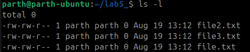

# Basic Linux Commands 

```bash
>> pwd 

```

📌 Output example:

```
/home/parth
```
## ls command

```bash
>> ls
```

📌 Output of ls:

```
clanguage.c  claungaunge.txt  Desktop  Documents  Downloads  Music  Pictures  projects  Public  snap  Templates  Videos
```

### ls flags

## ls command
The ls command is linux allows to to view all the files and folder in current working directory. Flag -a list down all file and folder including the one which are hidden

```bash
>> ls -la
```
📌 Output of ls - la:

```
total 112
drwxr-x--- 17 parth parth 4096 Aug 12 12:04 .
drwxr-xr-x  3 root  root  4096 Aug  6 22:17 ..
-rw-------  1 parth parth  706 Aug 11 09:13 .bash_history
-rw-r--r--  1 parth parth  220 Mar 31  2024 .bash_logout
-rw-r--r--  1 parth parth 3771 Mar 31  2024 .bashrc
drwx------ 14 parth parth 4096 Aug  7 11:39 .cache
-rw-rw-r--  1 parth parth    0 Aug 11 09:13 clanguage.c
-rw-rw-r--  1 parth parth    0 Aug 11 09:12 claungaunge.txt
drwxr-xr-x 13 parth parth 4096 Aug  7 10:35 .config
drwxr-xr-x  2 parth parth 4096 Aug  6 22:18 Desktop
drwxr-xr-x  2 parth parth 4096 Aug  6 22:18 Documents
drwxr-xr-x  2 parth parth 4096 Aug  6 22:18 Downloads
drwx------  2 parth parth 4096 Aug  6 22:26 .gnupg
drwx------  4 parth parth 4096 Aug  6 22:18 .local
drwxr-xr-x  2 parth parth 4096 Aug  6 22:18 Music
drwxr-xr-x  3 parth parth 4096 Aug  7 11:38 Pictures
-rw-r--r--  1 parth parth  807 Mar 31  2024 .profile
drwxrwxr-x  2 parth parth 4096 Aug  7 11:50 projects
drwxr-xr-x  2 parth parth 4096 Aug  6 22:18 Public
drwx------  4 parth parth 4096 Aug  6 22:40 snap
drwx------  2 parth parth 4096 Aug  6 22:18 .ssh
-rw-r--r--  1 parth parth    0 Aug  6 22:23 .sudo_as_admin_successful
drwxr-xr-x  2 parth parth 4096 Aug  6 22:18 Templates
-rw-r-----  1 parth parth    5 Aug 12 12:04 .vboxclient-clipboard-tty2-control.pid
-rw-r-----  1 parth parth    5 Aug 12 12:04 .vboxclient-clipboard-tty2-service.pid
-rw-r-----  1 parth parth    5 Aug 12 12:04 .vboxclient-draganddrop-tty2-control.pid
-rw-r-----  1 parth parth    5 Aug 12 12:04 .vboxclient-hostversion-tty2-control.pid
-rw-r-----  1 parth parth    5 Aug 12 12:04 .vboxclient-seamless-tty2-control.pid
-rw-r-----  1 parth parth    5 Aug 12 12:04 .vboxclient-vmsvga-session-tty2-control.pid
-rw-r-----  1 parth parth    5 Aug 12 12:04 .vboxclient-vmsvga-session-tty2-service.pid
drwxr-xr-x  2 parth parth 4096 Aug  6 22:18 Videos

```
## Image Screen Shot


---

## ✅ 1. **Navigation Commands**

### `pwd` – Print Working Directory

Shows the current location in the filesystem.

```bash
pwd
```

📌 Output example:

```
/home/parth
```


---

### `ls` – List Directory Contents

Lists files and folders in the current directory.

```bash
ls
```

* `ls -l` → Detailed list (permissions, size, date)
* `ls -a` → Shows hidden files (those starting with `.`)
* `ls -la` → Combined

---


### `cd` – Change Directory

Moves into a directory.

```bash
cd folder_name
```

Examples:

```bash
cd Documents        # Go to Documents
cd ..               # Go up one level
cd /                # Go to root
cd ~                # Go to home directory
```

---

## ✅ 2. **File and Directory Management**

### `mkdir` – Make Directory

Creates a new folder.

```bash
mkdir new_folder
```


---

### `touch` – Create File

Creates an empty file.

```bash
touch file.txt
```


---

### `cp` – Copy Files or Directories

```bash
cp source.txt destination.txt
```


* Copy folder:

```bash
cp -r folder1 folder2
```

---

### `mv` – Move or Rename Files

```bash
mv oldname.txt newname.txt
```

```bash
mv file.txt ~/Documents/     # Move file
```


---

### `rm` – Remove Files

```bash
rm file.txt          # Delete file
rm -r folder_name    # Delete folder (recursively)
```


⚠️ **Be careful!** There is no undo.

---

## ✅ 3. **File Viewing & Editing**

### `cat` – View File Contents

Displays content in terminal.

```bash
cat file.txt
```

---

### `nano` – Edit Files in Terminal

A basic terminal-based text editor.

```bash
nano file.txt
```

* Use arrows to move
* `CTRL + O` to save
* `CTRL + X` to exit

---

### `clear` – Clears the Terminal

```bash
clear
```

Shortcut: `CTRL + L`

---

## ✅ 4. **System Commands**

### `echo` – Print Text

Useful for debugging or scripting.

```bash
echo "Hello, World!"
```


---

### `whoami` – Show Current User

```bash
whoami
```


---

### `man` – Manual for Any Command

```bash
man ls
```

Use `q` to quit the manual.

---

## ✅ 5. **Searching and Finding**

### `find` – Locate Files

```bash
find . -name "*.txt"
```

🔍 Finds all `.txt` files in current folder and subfolders.

---

### `grep` – Search Inside Files

```bash
grep "hello" file.txt
```

🔍 Searches for the word `hello` inside `file.txt`.

---

## ✅ 6. **Helpful Shortcuts**

| Shortcut   | Action                      |
| ---------- | --------------------------- |
| `Tab`      | Auto-complete files/folders |
| `↑ / ↓`    | Browse command history      |
| `CTRL + C` | Stop a running command      |
| `CTRL + L` | Clear screen                |

---

## ✅ 7. **Bonus: Chaining Commands**

* **Run multiple commands**:

```bash
mkdir test && cd test && touch hello.txt
```


* **Run only if previous command succeeds**: `&&`
* **Run regardless of success**: `;`

---


# 🐚 Shell Tutorial – File Permissions with `chmod` and `chown`

---

## 🔹 1. Understanding File Permissions in Linux

Each file/directory in Linux has:

* **Owner** → The user who created the file.
* **Group** → A group of users who may share access.
* **Others** → Everyone else.

### PERMISSION TYPES

* **r** → Read (4 in numeric)
* **w** → Write (2 in numeric)
* **x** → Execute (1 in numeric)

### Permission Layout

Example from `ls -l`:

```
-rwxr-xr--
```

Breakdown:

* `-` → Regular file (`d` = directory, `l` = symlink, etc.)
* `rwx` → Owner has read, write, execute
* `r-x` → Group has read, execute
* `r--` → Others have read only




---
## 🔹 2. `chmod` – Change File Permissions

### Syntax

```bash
chmod [options] mode filename
```

Modes can be set in **numeric (octal)** or **symbolic** form.

---


### (A) Numeric (Octal) Method

Each permission is represented as a number:

* Read = 4
* Write = 2
* Execute = 1

Add them up:

* `7 = rwx`
* `6 = rw-`
* `5 = r-x`
* `4 = r--`
* `0 = ---`

#### Example:

```bash
chmod 755 script.sh
```

Meaning:

* Owner: 7 → `rwx`
* Group: 5 → `r-x`
* Others: 5 → `r-x`


---

### (B) Symbolic Method

Use `u` (user/owner), `g` (group), `o` (others), `a` (all).
Operators:

* `+` → Add permission
* `-` → Remove permission
* `=` → Assign exact permission

#### Examples:

```bash
chmod u+x script.sh     # Add execute for owner
chmod g-w notes.txt     # Remove write from group
chmod o=r file.txt      # Set others to read only
chmod a+r report.txt    # Everyone gets read access
```


---

### (C) Recursive Changes

```bash
chmod -R 755 /mydir
```

* `-R` → applies changes recursively to all files/subdirectories.


---

## 🔹 3. `chown` – Change File Ownership

### Syntax

```bash
chown [options] new_owner:new_group filename
```

### Examples:

```bash
chown parth file.txt               # Change owner to user 'vibhu'
chown parth:newuser file.txt       # Change owner to 'vibhu' and group to 'dev'
chown :newuser file.txt            # Change only group to 'dev'
chown -R parth:newuser /project    # Recursive ownership change
```

---
## 🔹 4. Putting It All Together

### Example Scenario

```bash
touch project.sh
ls -l project.sh
```

Output:

```
-rw-r--r-- 1 parth 0 Aug 19 12:00 project.sh
```


Now:

```bash
chmod 700 project.sh         # Only owner has rwx
chmod u+x,g-w project.sh     # Add execute for user, remove write for group
chown root:admin project.sh  # Change owner to root and group to admin
```


---

## 🔹 5. Quick Reference Table

| Numeric | Permission | Meaning      |
| ------- | ---------- | ------------ |
| 0       | ---        | No access    |
| 1       | --x        | Execute only |
| 2       | -w-        | Write only   |
| 3       | -wx        | Write + Exec |
| 4       | r--        | Read only    |
| 5       | r-x        | Read + Exec  |
| 6       | rw-        | Read + Write |
| 7       | rwx        | Full access  |

---

✅ **Key Tip**: Use **numeric for quick settings** (e.g., 755, 644) and **symbolic for fine adjustments** (`u+x`, `g-w`).

---

# Extra Questions:


## 1. What is the difference between `chmod` and `chown`?

**Answer:**
- `chmod` → Changes the **permissions** of a file or directory (read, write, execute).  
- `chown` → Changes the **ownership** of a file or directory (which user or group owns it).  

---

## 2. How do you check current directory and user?

**Answer:**
- To check the current directory:  
  ```bash
  pwd
