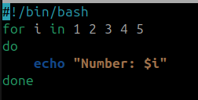
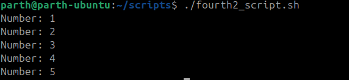

# Assignment 2 – Script Execution & Explanation


## Print Numbers-

### For loop

```bash
for i in 1 2 3 4 5
do
    echo "Number: $i"
done
```




Output-



### Explanation:

The for loop iterates over the list of numbers 1 2 3 4 5.

In each iteration, the value is stored in variable i.

The command echo "Number: $i" prints the current value of i.

This is a simple way to repeat a command for multiple values.


## Array Loop-

```bash
fruits=("apple" "banana" "cherry")

echo "First fruit: ${fruits[0]}"

for fruit in "${fruits[@]}"; do
    echo "Fruit: $fruit"
done
```


Output-


---


### Explanation:

An array fruits is created with three elements: "apple", "banana", and "cherry".

${fruits[0]} accesses the first element of the array (index starts from 0).

The for loop iterates through all elements of the array using "${fruits[@]}".

In each iteration, the current array element is stored in the variable fruit and printed with echo.

---

# Extra Questions:

## 1. What is the purpose of `#!/bin/bash` at the top of a script?

**Answer:**
- This line is called a **shebang**.  
- It tells the operating system which interpreter should be used to run the script.  
- In this case, `#!/bin/bash` specifies that the script should be executed using the **Bash shell**.  
- Without it, the script might run with a different shell, causing unexpected errors.  

---

## 2. How do you make a script executable?

**Answer:**
- After writing a script (e.g., `script.sh`), you need to give it **execute permission**.  
- Use the command:  
  ```bash
  chmod +x script.sh

