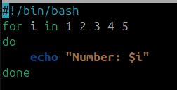

# LAB 3 – Enhanced Number Printing Script

## 1. Original Script (print_numbers.sh)

```bash
for i in 1 2 3 4 5
do
    echo "Number: $i"
done

```




Output-


### Explanation:


The for loop iterates over the list of numbers 1 2 3 4 5.

In each iteration, the value is stored in the variable i.

The command echo "Number: $i" prints the current value of i.

Limitation: The script always prints fixed numbers and cannot accept user input.


---

## 2. New Script (enhanced_numbers.sh)

```bash
#!/bin/bash
# Enhanced version of print_numbers.sh
# User provides start, end, and step values


read -p "Enter start value: " start
read -p "Enter end value: " end
read -p "Enter step value: " step


if [ "$step" -le 0 ]; then
    echo "Error: Step value must be a positive number."
    exit 1
fi

if [ "$start" -gt "$end" ]; then
    echo "Error: Start value must be less than or equal to End value."
    exit 1
fi


for i in $(seq $start $step $end)
do
    echo "Number: $i"
done

```


### Explanation:

The user is prompted to enter start, end, and step values.

Input validation ensures:

Step must be positive.

Start ≤ End.

The script uses seq to generate a range dynamically.

Each number is printed with the message Number: $i.

This makes the script flexible and interactive compared to the original.

---
### 1. Example Run – Valid Input


### 2. Example Run – Invalid Step


---


### 3. Example Run – Invalid Range


---


# Extra Questions

## Difference between `$1`, `$@`, and `$#` in bash?

- **`$1`**  
  Refers to the **first argument** passed to the script.  
  Example:  

```bash
  ./script.sh hello world
  echo $1   # Output: hello
```

- **`$@`**
Refers to all the arguments passed to the script, treated as separate words.
Example:
```bash
./script.sh hello world
echo $@   # Output: hello world
```

- **`$#`**
Refers to the number of arguments passed to the script.
Example:
```bash
./script.sh hello world
echo $#   # Output: 2
```

## What does exit 1 mean in a script?

- **`exit is used to terminate a script and return an exit status code to the shell.`**

### By convention:

- **`exit 0 → Success (no error).`**

- **`exit 1 → General error / failure.`**


## Example:
```bash
#!/bin/bash
if [ $# -eq 0 ]; then
  echo "No arguments provided."
  exit 1   # Script ends with failure
fi

echo "Arguments provided."
exit 0     # Script ends successfully
```