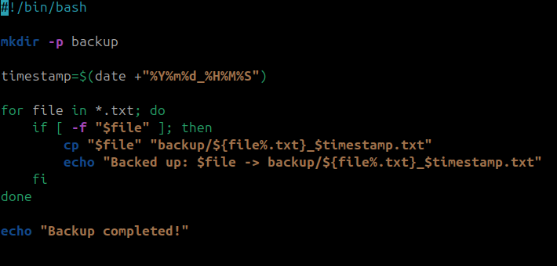
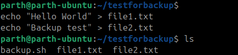

# Assignment 4 – File & Backup Automation

## Objective
Automate file management using a shell script.

---

## Script: `backup.sh`

### How the script works
1. Creates a `backup/` folder if it doesn’t exist.  
2. Gets the current timestamp using `date +"%Y%m%d_%H%M%S"`.  
3. Loops through all `.txt` files in the current directory.  
4. Copies each `.txt` file into the `backup/` folder, renaming it with the timestamp.  
   - Example: `notes.txt` → `backup/notes_20250910_193045.txt`  
5. Prints a message for each backup file created.  
6. Ends with a confirmation message: `Backup completed!`.

---

## Code-
```bash
#!/bin/bash
# backup.sh
# Automates backup of .txt files with timestamp

# Create backup directory if it doesn’t exist
mkdir -p backup

# Get current timestamp
timestamp=$(date +"%Y%m%d_%H%M%S")

# Find and copy all .txt files with timestamp in filename
for file in *.txt; do
    if [ -f "$file" ]; then
        cp "$file" "backup/${file%.txt}_$timestamp.txt"
        echo "Backed up: $file -> backup/${file%.txt}_$timestamp.txt"
    fi
done

echo "Backup completed!"

```


---


## Example Run

### Step 1: Create test files
```bash
echo "Hello World" > file1.txt
echo "Backup test" > file2.txt
```




### Step 2: Run script
```bash
./backup.sh
```


### Step 3: Output
```bash
Backed up: file1.txt -> backup/file1_20250910_193045.txt
Backed up: file2.txt -> backup/file2_20250910_193045.txt
Backup completed!

```


### Step 4: Check backup folder
```bash
ls backup
```

---
## Output:
```bash
file1_20250910_193045.txt
file2_20250910_193045.txt

```


# Extra Questions

## What is the difference between `cp`, `mv`, and `rsync`?

- **`cp` (copy)**  
  - Copies files or directories from one location to another.  
  - Original file remains in place.  
```bash
  cp file.txt backup/
```

- **`mv` (move)** 
  - Moves or renames files/directories.
  - Original file is removed from the source after moving.
```bash
  mv file.txt backup/
```

- **`rsync` (remote sync)**  
  - Advanced tool for syncing files/directories.  
  - Supports incremental transfer (copies only changes).
  - Works locally or over SSH.
   
```bash
  rsync -av file.txt backup/
```


## How can you schedule scripts to run automatically?

- **You can use cron jobs in Linux/Unix systems.** 

 -Cron allows scheduling tasks at specific times/dates.

### Steps:
```bash
- **Open cron editor:**

crontab -e
```

- **Add an entry in the format:**
```bash
* * * * * /path/to/script.sh
```

- **Each * represents: minute, hour, day of month, month, day of week.**

## Example: Run backup.sh every day at 2 AM:
```bash
0 2 * * * /home/user/backup.sh
```