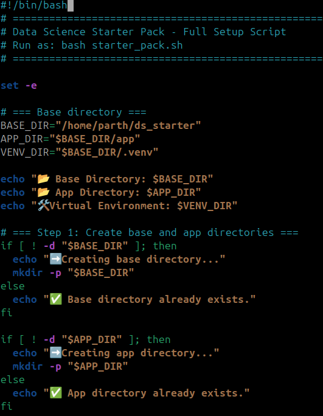
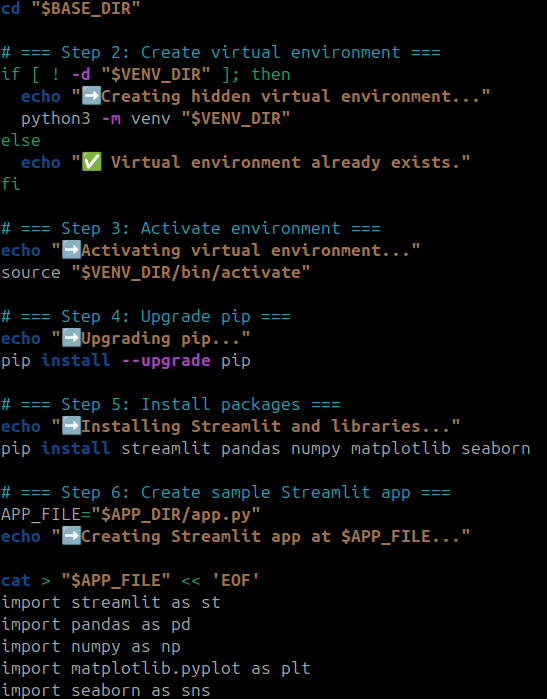
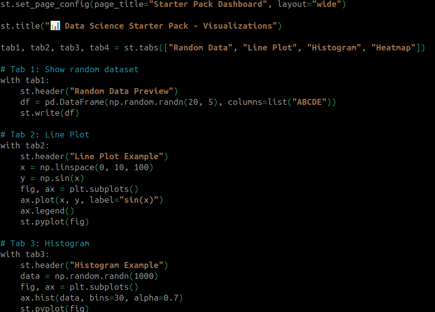
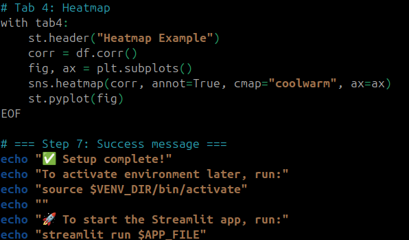
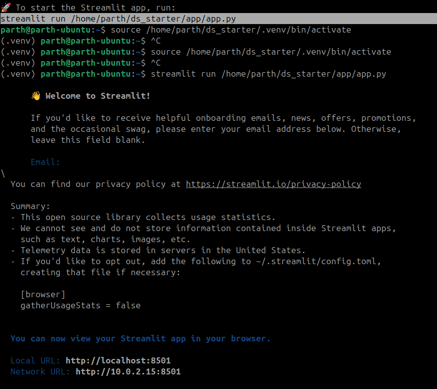

# Lab 5 – Starter Kit & Automation

### Code
```bash

#!/bin/bash
# ==========================================================
# Data Science Starter Pack - Full Setup Script
# Run as: bash starter_pack.sh
# ==========================================================

set -e

# === Base directory ===
BASE_DIR="/home/parth/ds_starter"
APP_DIR="$BASE_DIR/app"
VENV_DIR="$BASE_DIR/.venv"

echo "📂 Base Directory: $BASE_DIR"
echo "📂 App Directory: $APP_DIR"
echo "🛠️ Virtual Environment: $VENV_DIR"

# === Step 1: Create base and app directories ===
if [ ! -d "$BASE_DIR" ]; then
  echo "➡️ Creating base directory..."
  mkdir -p "$BASE_DIR"
else
  echo "✅ Base directory already exists."
fi

if [ ! -d "$APP_DIR" ]; then
  echo "➡️ Creating app directory..."
  mkdir -p "$APP_DIR"
else
  echo "✅ App directory already exists."
fi

cd "$BASE_DIR"

# === Step 2: Create virtual environment ===
if [ ! -d "$VENV_DIR" ]; then
  echo "➡️ Creating hidden virtual environment..."
  python3 -m venv "$VENV_DIR"
else
  echo "✅ Virtual environment already exists."
fi

# === Step 3: Activate environment ===
echo "➡️ Activating virtual environment..."
source "$VENV_DIR/bin/activate"

# === Step 4: Upgrade pip ===
echo "➡️ Upgrading pip..."
pip install --upgrade pip

# === Step 5: Install packages ===
echo "➡️ Installing Streamlit and libraries..."
pip install streamlit pandas numpy matplotlib seaborn

# === Step 6: Create sample Streamlit app ===
APP_FILE="$APP_DIR/app.py"
echo "➡️ Creating Streamlit app at $APP_FILE..."

cat > "$APP_FILE" << 'EOF'
import streamlit as st
import pandas as pd
import numpy as np
import matplotlib.pyplot as plt
import seaborn as sns

st.set_page_config(page_title="Starter Pack Dashboard", layout="wide")

st.title("📊 Data Science Starter Pack - Visualizations")

tab1, tab2, tab3, tab4 = st.tabs(["Random Data", "Line Plot", "Histogram", "Heatmap"])

# Tab 1: Show random dataset
with tab1:
    st.header("Random Data Preview")
    df = pd.DataFrame(np.random.randn(20, 5), columns=list("ABCDE"))
    st.write(df)

# Tab 2: Line Plot
with tab2:
    st.header("Line Plot Example")
    x = np.linspace(0, 10, 100)
    y = np.sin(x)
    fig, ax = plt.subplots()
    ax.plot(x, y, label="sin(x)")
    ax.legend()
    st.pyplot(fig)

# Tab 3: Histogram
with tab3:
    st.header("Histogram Example")
    data = np.random.randn(1000)
    fig, ax = plt.subplots()
    ax.hist(data, bins=30, alpha=0.7)
    st.pyplot(fig)

# Tab 4: Heatmap
with tab4:
    st.header("Heatmap Example")
    corr = df.corr()
    fig, ax = plt.subplots()
    sns.heatmap(corr, annot=True, cmap="coolwarm", ax=ax)
    st.pyplot(fig)
EOF

# === Step 7: Success message ===
echo "✅ Setup complete!"
echo "To activate environment later, run:"
echo "source $VENV_DIR/bin/activate"
echo ""
echo "🚀 To start the Streamlit app, run:"
echo "streamlit run $APP_FILE"

```










### Output at the end-




# Extra Questions

## What does `mkdir -p` do?

- The `mkdir` command is used to create directories.  
- The `-p` option tells `mkdir` to:
  1. **Create parent directories** if they do not exist.  
  2. **Ignore error** if the directory already exists.  

Example:  
```bash
mkdir -p dir1/dir2/dir3

```
This will create dir1, dir1/dir2, and dir1/dir2/dir3 in one command.


## Why is automation useful in DevOps?

- **` Automation is a core principle of DevOps because it:`**

    - **` Reduces manual effort and human error.`**

    - **` Speeds up software delivery (CI/CD pipelines).`**

    - **` Ensures consistency across environments (development, testing, production).`**

    - **` Improves scalability and reliability.`**

- **` Example areas of automation in DevOps:`**

    - **` Code integration and testing (CI).`**

    - **` Deployment and configuration management (CD).`**

    - **` Monitoring and alerting.`**