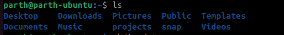
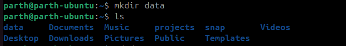

# Linux Terminal Commands — 


---

## `ls`

**Purpose:** List files and directories in the current directory.

**Syntax:**
```
ls [options] [path]
```



**Examples:**

```
ls               # list names
ls -l            # long listing (permissions, owner, size, date)
ls -a            # show hidden files (names starting with .)
ls -la /home/user # combination, on a specific path
```

---

## `mkdir`

**Purpose:** Create a new directory.

**Syntax:**

```
mkdir [options] <directory-name>
```




**Examples:**

```
mkdir project          # create "project" directory
mkdir -p a/b/c         # create nested dirs (parents) in one command
```

---

## `cd`

**Purpose:** Change the current working directory.

**Syntax:**

```
cd [directory]
```

**Examples:**

```
cd project            # go into project directory
cd /var/log           # go to an absolute path
cd ~                  # go to your home directory (same as cd)
cd -                  # switch to previous directory
```

---

## `touch`

**Purpose:** Create an empty file or update the timestamp of an existing file.

**Syntax:**

```
touch <filename>
```

**Examples:**

```
touch notes.txt       # create an empty notes.txt (if not exists)
touch file1 file2     # create multiple files at once
```

---


## `cd ..`

**Purpose:** Move up one directory (to the parent directory).


**Example:**

```
cd ..                 # go one level up
cd ../..              # go two levels up
```

---

## `cp`

**Purpose:** Copy files or directories.

**Syntax:**

```
cp [options] <source> <destination>
```


**Examples:**

```
cp file.txt backup.txt         # copy file.txt to backup.txt
cp file1.txt file2.txt folder/ # copy multiple files into a folder
cp -r dir1 dir2                # copy directory recursively
```

---


## `rm`


**Purpose:** Remove (delete) files.

**Syntax:**

```
rm [options] <file>
```

**Examples:**

```
rm oldfile.txt        # delete a single file
rm file1 file2        # delete multiple files
rm -i file            # ask before removing (interactive)
```

---

## `rm -rf`

**Purpose:** Recursively and forcibly remove directories and their contents.

**Syntax:**

```
rm -rf <path>
```


**Warning:** `rm -rf` is powerful and dangerous. It will delete files and directories **without** asking. Always double-check the path before running.

**Safer tips:**

- Use `rm -ri` to prompt for each file.
- Test with `ls <path>` first to confirm what will be removed.
- Consider using a trash tool (`trash-cli`) which moves files to the recycle bin instead of permanently deleting them.

**Example:**

```
rm -rf build/        # delete build directory and everything inside it
```

---

## Quick safety checklist

- Never run `rm -rf /` or `sudo rm -rf /` unless you absolutely know what you're doing.
- Use `ls` to preview directory contents before removing.
- Use `-i` for interactive deletion when unsure.
