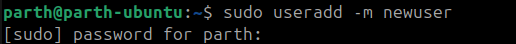
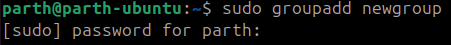
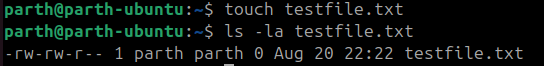
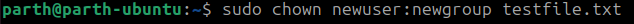
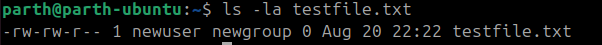

Practice Experiment
---

### 🔹 1. Create a new user

```bash
sudo useradd -m newuser
```



* `-m` → creates a home directory `/home/newuser`.

---

### 🔹 2. Create a new group

```bash
sudo groupadd newgroup
```



---

### 🔹 3. Add the user to the group

```bash
sudo usermod -aG newgroup newuser
```

* `-aG` → append user to the supplementary group (doesn’t remove existing groups).


---

### 🔹 4. Create a file (as current user, e.g. root or your login user)

```bash
touch testfile.txt
```


Check ownership:

```bash
ls -l testfile.txt
```



Example:

```
-rw-r--r-- 1 ubuntu ubuntu 0 Aug 20 14:02 testfile.txt
```

---

### 🔹 5. Assign ownership of the file to `newuser` and `newgroup`

```bash
sudo chown newuser:newgroup testfile.txt
```



---

### 🔹 6. Verify ownership

```bash
ls -l testfile.txt
```



Output:

```
-rw-r--r-- 1 newuser newgroup 0 Aug 20 14:02 testfile.txt
```

---