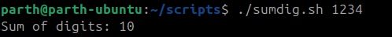

# Armstrong Number Checker (Bash Script)

This script checks whether a given number is an **Armstrong number**.

---


## 📜 Script

```bash
#!/bin/bash
# armstrong.sh
# Usage: ./armstrong.sh 153

if [ $# -ne 1 ]; then
  echo "Usage: $0 <non-negative-integer>"
  exit 1
fi

n="$1"
if ! [[ $n =~ ^[0-9]+$ ]]; then
  echo "Input must be a non-negative integer."
  exit 1
fi

# count digits
temp="$n"; digits=0
while [ "$temp" -gt 0 ]; do
  temp=$(( temp / 10 ))
  ((digits++))
done
# handle zero
[ $digits -eq 0 ] && digits=1

sum=0
temp="$n"
while [ "$temp" -gt 0 ]; do
  d=$(( temp % 10 ))
  # compute d^digits
  pow=1
  for ((i=0;i<digits;i++)); do pow=$(( pow * d )); done
  sum=$(( sum + pow ))
  temp=$(( temp / 10 ))
done

if [ "$sum" -eq "$n" ]; then
  echo "$n is an Armstrong number."
else
  echo "$n is NOT an Armstrong number (sum=$sum)."
fi

```


---

✅ **Explanation**:  
An Armstrong number (also known as a narcissistic number) is a number that is equal to the sum of its own digits each raised to the power of the number of digits.  
For example, `153 = 1^3 + 5^3 + 3^3`.

## 📌 Usage

```bash
./armstrong.sh <number>
```

Example:

```bash
./armstrong.sh 153
```

Output:

```
153 is an Armstrong number.
```


---
## TABLE -

- When number is 153

| step | temp | digit(d) | d^digit | sum | new temp |
| --- | --- | --- | --- | --- | --- |
| 1   | 153 | 3   | 27  | 27  | 15  |
| 2   | 15  | 5   | 125 | 152 | 1   |
| 3   | 1   | 1   | 1   | 1   | 0   |


# Prime Number Checker (Bash Script)

This script checks whether a given number is **prime**.

---

✅ **Explanation**:  
A prime number is a number greater than 1 that has no divisors other than 1 and itself.  
For example: `17` is prime, but `18` is not because it is divisible by `2`, `3`, `6`, and `9`.

## 📜 Script

```bash
#!/bin/bash
# prime_check.sh
# Usage: ./prime_check.sh 17

if [ $# -ne 1 ]; then
  echo "Usage: $0 <positive-integer>"
  exit 1
fi

n=$1
if ! [[ $n =~ ^[0-9]+$ ]] || [ "$n" -le 1 ]; then
  echo "$n is not a prime (need integer > 1)."
  exit 1
fi

is_prime=1
i=2
while [ $((i * i)) -le "$n" ]; do
  if [ $((n % i)) -eq 0 ]; then
    is_prime=0
    break
  fi
  ((i++))
done

if [ $is_prime -eq 1 ]; then
  echo "$n is prime."
else
  echo "$n is NOT prime (divisible by $i)."
fi

```


---


## 📌 Usage

```bash
./prime_check.sh <number>
```

Example:

```bash
./prime_check.sh 17
```

Output:

```
17 is prime.
```


---


# Sum of Digits (Bash Script)

This script calculates the **sum of digits** of a given non-negative integer.

---


## 📜 Script

```bash
#!/bin/bash
# sum_digits.sh
# Usage: ./sum_digits.sh 1234

if [ $# -ne 1 ]; then
  echo "Usage: $0 <non-negative-integer>"
  exit 1
fi

num="$1"
if ! [[ $num =~ ^[0-9]+$ ]]; then
  echo "Input must be a non-negative integer."
  exit 1
fi

sum=0
while [ "$num" -gt 0 ]; do
  digit=$(( num % 10 ))
  sum=$(( sum + digit ))
  num=$(( num / 10 ))
done

echo "Sum of digits: $sum"

```


---

## 📌 Usage

```bash
./sum_digits.sh <number>
```

Example:

```bash
./sum_digits.sh 1234
```

Output:

```
Sum of digits: 10
```



---


# Palindrome Number Script

## 📌 Description

This Bash script checks whether a given **non-negative integer** is a  
palindrome.  
A palindrome number is the same when read forwards or backwards (e.g.,  
`1221`, `121`, `5`).

* * *

## ✅ Explanation

- `$#` → checks the number of arguments passed.\\
- `[[ $n =~ ^[0-9]+$ ]]` → ensures the input is a non-negative  
    integer.\\
- `rev=$(( rev * 10 + (n % 10) ))` → builds the reverse number digit  
    by digit.\\
- At the end, compares original (`orig`) and reversed (`rev`).

If they are equal → it's a palindrome, otherwise not.

* * *

&nbsp;

## 📜 Code

```bash
#!/bin/bash


if [ $# -ne 1 ]; then
  echo "Usage: $0 <non-negative-integer>"
  exit 1
fi
n="$1"
if ! [[ $n =~ ^[0-9]+$ ]]; then
  echo "Must be a non-negative integer."
  exit 1
fi

orig="$n"
rev=0
while [ "$n" -gt 0 ]; do
  rev=$(( rev * 10 + (n % 10) ))
  n=$(( n / 10 ))
done

[ "$orig" -eq "$rev" ] && echo "$orig is a palindrome." || echo "$orig is NOT a palindrome."
```


* * *

## ▶️ Usage

1.  Make the script executable:
    
    ```bash
    chmod +x palindrome_num.sh
    ```
    
2.  Run with a number:
    
    ```bash
    ./palindrome_num.sh <number>
    ```
    

* * *

## 🖥️ Examples

### Example 1: Palindrome

```bash
./palindrome_num.sh 1221
```

**Output:**

```
1221 is a palindrome.
```

### Example 2: Not a Palindrome

```bash
./palindrome_num.sh 1234
```

**Output:**

```
1234 is NOT a palindrome.
```

### Example 3: Invalid Input

```bash
./palindrome_num.sh abc
```

**Output:**

```
Must be a non-negative integer.
```


* * *

&nbsp;

## TABLE -

- When number is 1221

| STEP | `n` (before loop) | `n % 10` (last digit) | rev = rev \* 10 + (n % 10) | New `rev` | New `n` (n/10) |
| --- | --- | --- | --- | --- | --- |
| 1   | 1221 | 1   | `0 * 10 + 1` | 1   | 122 |
| 2   | 122 | 2   | `1 * 10 + 2` | 12  | 12  |
| 3   | 12  | 2   | `12 * 10 + 2` | 122 | 1   |
| 4   | 1   | 1   | `122 * 10 + 1` | 1221 | 0   |