Linux Process Commands

# Linux Process Management Commands

------------------------------------------------------------------------

## 🌐 1. List Processes

**Command:**

``` bash
ps aux
```

-   **a** → show processes for all users\
-   **u** → show user/owner of process\
-   **x** → show processes not attached to a terminal

**This command gives a snapshot of all processes, showing who owns them, how much CPU/memory they use, and what command started them. It combines a (all users), u (show user/owner), and x (include processes not attached to a terminal). It’s mainly used for quickly checking running processes or filtering with grep to find a specific one**


**Example Output:**

    USER       PID  %CPU %MEM    VSZ   RSS TTY      STAT START   TIME COMMAND
    root         1  0.0  0.1 167500  1100 ?        Ss   Sep25   0:05 /sbin/init
    parth     1234  1.2  1.5 274532 15632 ?        Sl   10:15   0:12 /usr/bin/python3 script.py
    mysql     2001  0.5  2.0 450000 20988 ?        Ssl  Sep25   1:02 /usr/sbin/mysqld

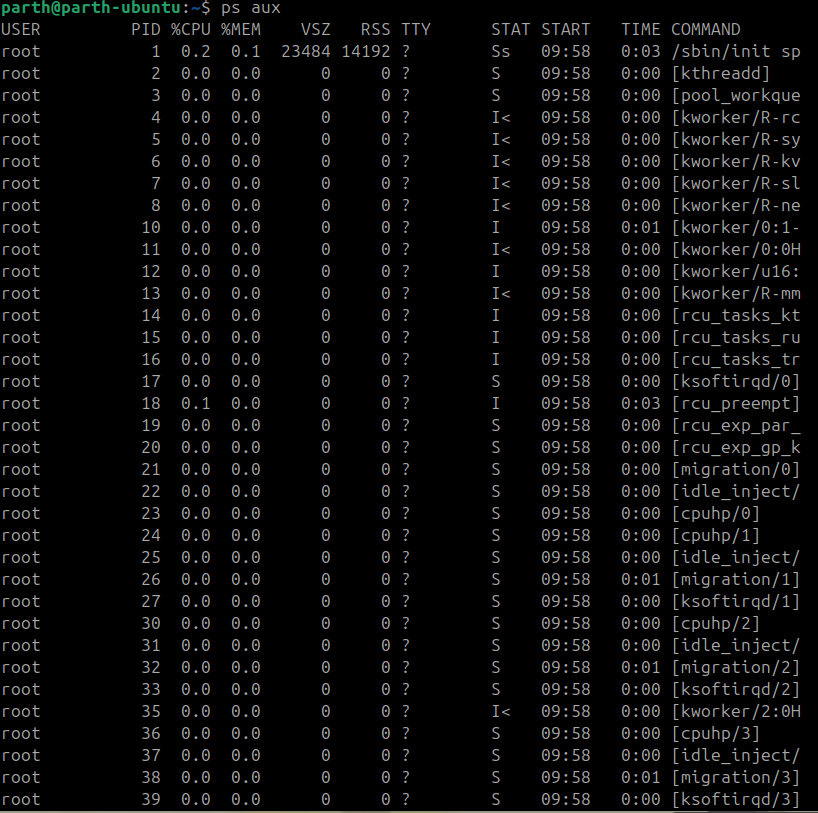

------------------------------------------------------------------------

## 🌲 2. Process Tree

**Command:**

``` bash
pstree -p
```

👉 Shows parent-child process relationships.

**This shows processes in a tree format, making parent-child relationships clear. With -p, it also displays the PID alongside each process name. It’s useful for understanding which processes were started by which parent, such as services, shells, or daemons**

**Example Output:**

    systemd(1)─┬─NetworkManager(778)
               ├─sshd(895)─┬─sshd(1023)───bash(1024)───pstree(1101)
               ├─mysqld(2001)
               └─python3(1234)

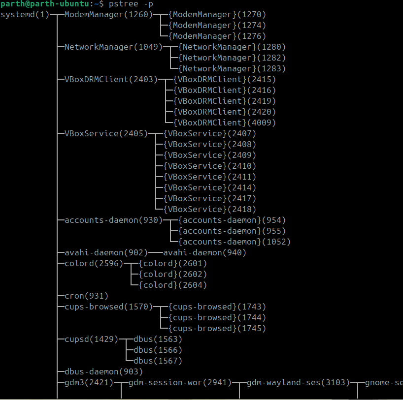
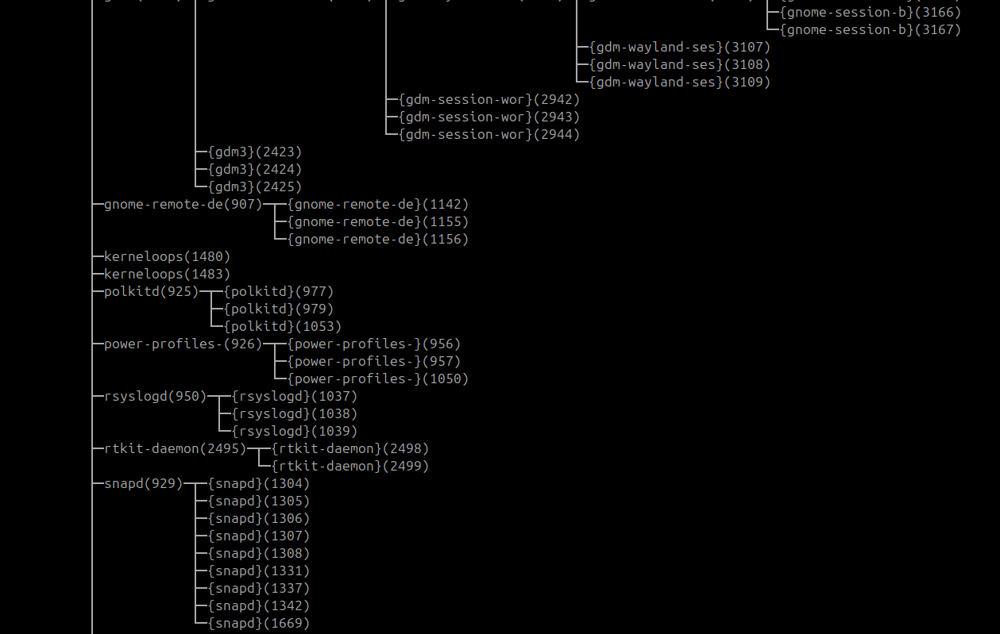

------------------------------------------------------------------------

## 📊 3. Real-Time Monitoring

**Command:**

``` bash
top
```

👉 Press `q` to quit.
**An interactive tool that updates in real-time to show system load, CPU/memory usage, and process activity. You can sort processes, kill them, or change their priority from inside top. It’s the go-to tool for monitoring a system’s current performance.**


**Example Output (partial):**

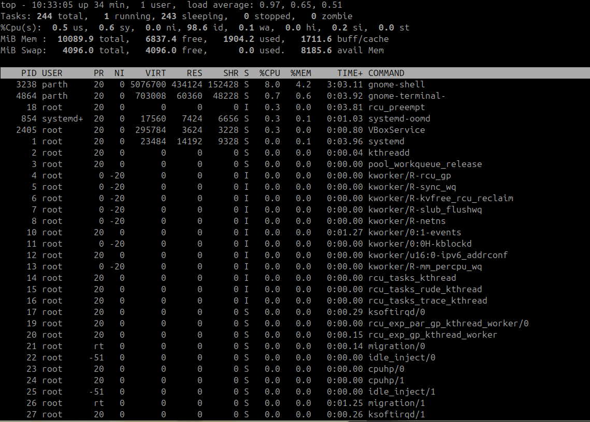

------------------------------------------------------------------------

## ⚡ 4. Adjust Process Priority

**nice starts a process with a defined priority (niceness value) while renice changes the priority of an already running one. Lower values mean higher priority; raising priority often requires root. They help balance background tasks against interactive workloads.**

-   Start process with low priority:

``` bash
nice -n 10 sleep 300 &
```


Output:
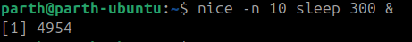


-   Change priority of running process:

``` bash
renice -n -5 -p 5196
```

Output:
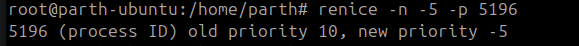


------------------------------------------------------------------------

## 🔧 5. CPU Affinity (Bind Process to CPU Core)
**This command binds a process to specific CPU cores, known as setting its CPU affinity. It can either start a new process on chosen cores or adjust an existing one with -p. Useful for performance tuning or keeping critical processes isolated from others.**

**Check affinity:**

``` bash
taskset -cp 5196
```


Output:


**Restrict to core 1 only:**

``` bash
taskset -cp 1 5260
```

Output:
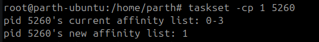

------------------------------------------------------------------------

## 📂 6. I/O Scheduling Priority

**ionice sets how the I/O scheduler treats a process when accessing disks. With class 3 (idle), the process only performs I/O when no one else needs the disk. It prevents background jobs from slowing down interactive programs**

**Command:**

``` bash
ionice -c 3 -p 5260
```
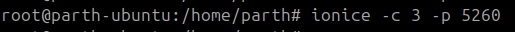
Output:

    successfully set pid 5260's IO scheduling class to idle

👉 Class 3 (idle) → Process only gets I/O when system is idle.

------------------------------------------------------------------------

## 📑 7. File Descriptors Used by a Process

Lists all files a process has opened, including regular files, libraries, sockets, and devices. Since “everything is a file” in Linux, it shows where a process is reading/writing or what resources it holds. Very helpful for debugging “file in use” or port conflicts.

**Command:**

``` bash
lsof -p 5260 | head -5
```

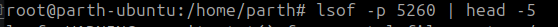

**Example Output:**

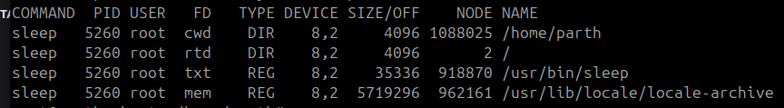

------------------------------------------------------------------------

## 🐛 8. Trace System Calls of a Process
**Attaches to a running process and logs every system call it makes (like open, read, write, connect). This is extremely useful for debugging crashes, permission errors, or why a program hangs. However, it slows the process while tracing, so use it carefully.**


**Command:**

``` bash
strace -p 5620
```

**Example Output:**

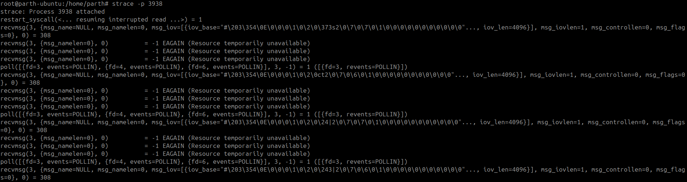

------------------------------------------------------------------------

## 📡 9. Find Process Using a Port

**fuser tells you which process is using a specific file, socket, or port. For example, fuser -n tcp 8080 shows the PID using TCP port 8080. Handy for troubleshooting when a service won’t start because the port is already in use.**

**Command:**

``` bash
sudo fuser -n tcp 8080
```

Output:

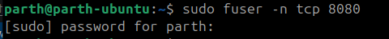

    8080/tcp:           4321

👉 PID 4321 is using port 8080.

------------------------------------------------------------------------

## 📊 10. Per-Process Statistics
**Reports per-process statistics like CPU, memory, or I/O usage at intervals. Unlike ps, it continuously samples, making it good for spotting spikes or trends. It’s lightweight and useful for performance analysis of specific processes.**

**Command:**

``` bash
pidstat -p 3200 2 3
```

**Example Output:**
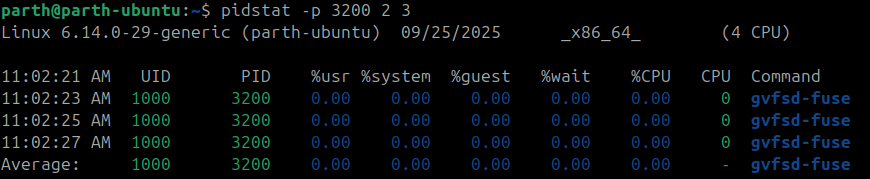


------------------------------------------------------------------------

## 🔐 11. Control Groups (cgroups) for Resource Limits

**Control Groups (cgroups) let you restrict CPU, memory, and I/O resources for processes. You can create a group, set resource limits, and add processes into it. This is essential for isolating workloads and preventing a single process from consuming all resources**


-   Create a new cgroup:

``` bash
sudo cgcreate -g cpu,memory:/testgroup
```


-   Limit CPU and Memory:

``` bash
echo "50000 100000" | sudo tee /sys/fs/cgroup/testgroup/cpu.max
echo 100M | sudo tee /sys/fs/cgroup/testgroup/memory.max
```

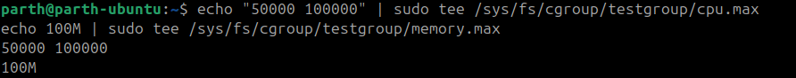

-   Add a process (PID 3050) to cgroup:

``` bash
echo 3050 | sudo tee /sys/fs/cgroup/testgroup/cgroup.procs
```

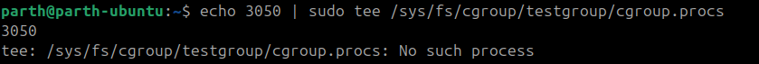

------------------------------------------------------------------------

