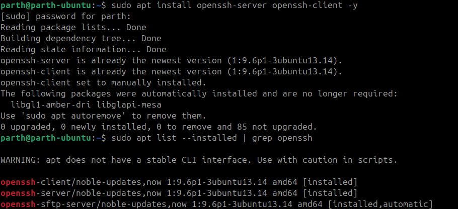
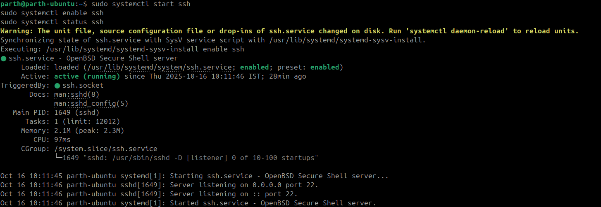
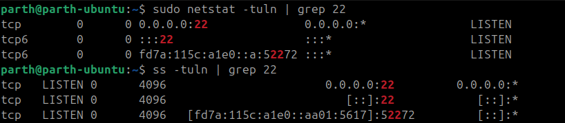
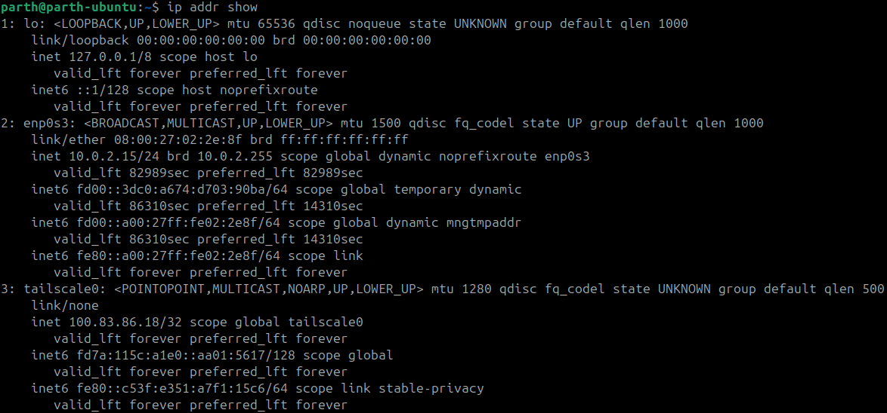
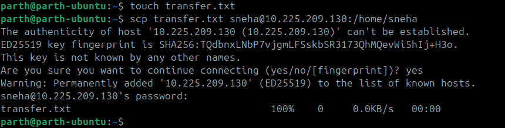
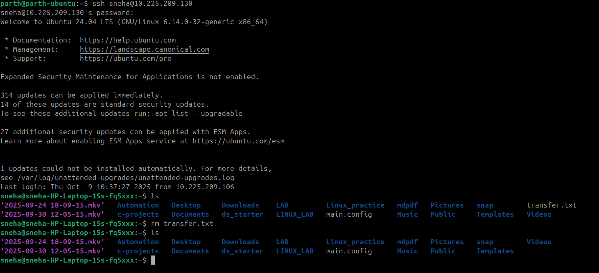
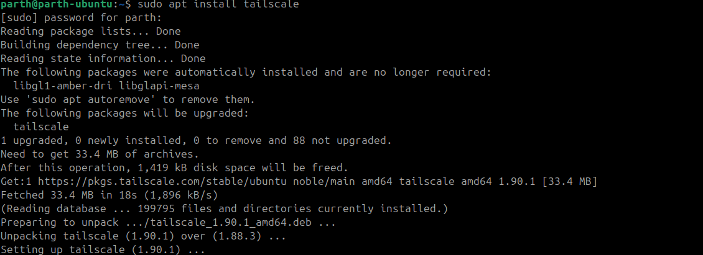
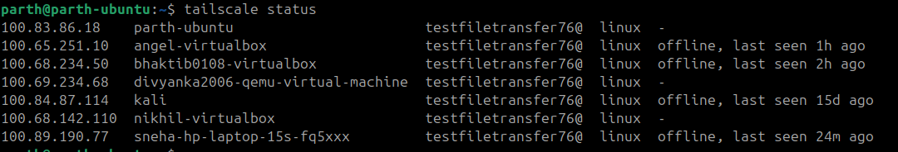
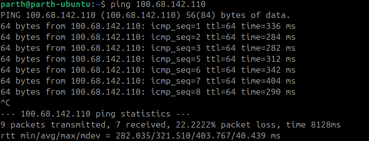
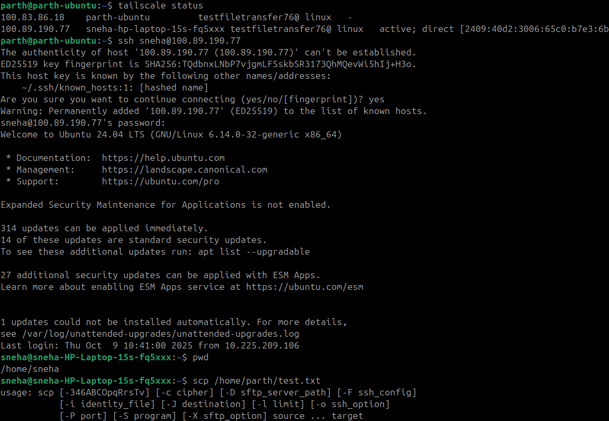

# 🧪 Experiment: Secure Shell (SSH) in Linux

## 🎯 Aim
To study and implement Secure Shell (SSH) protocol in Linux for secure remote login and file transfer between systems.

---

## 🧩 Objectives
- Understand the working principle of SSH.  
- Learn to configure and use SSH on Linux.  
- Perform remote login and file transfer using SSH commands.  
- Test authentication and connectivity between two systems.

---

## 🧠 Theory
**SSH (Secure Shell)** is a cryptographic network protocol that allows secure communication between two networked devices.  
It replaces older protocols like Telnet and Rlogin, which transmit data (including passwords) in plain text.

### Key Features:
- Encrypted communication  
- Secure authentication (password or key-based)  
- File transfer using `scp` or `sftp`  
- Remote command execution  

### SSH Architecture:
- **Client:** The machine initiating the connection (`ssh user@server_ip`)  
- **Server:** The machine running `sshd` (SSH Daemon) listening on port **22**  
- **Encryption:** Uses asymmetric cryptography (public/private keys)  

---

## ⚙️ Apparatus / Requirements
- Two Linux systems (or one local + one remote VM)  
- Network connectivity between both systems  
- SSH installed (`openssh-server` and `openssh-client`)  

---

## 🧾 Procedure (With Command Explanations)

### 🔹 Step 1: Check if SSH is Installed
```bash
sudo apt list --installed | grep openssh
```
**Explanation:**  
- `sudo` – runs the command with administrator privileges.  
- `apt list --installed` – lists all installed packages.  
- `grep openssh` – filters and displays only lines containing “openssh”.

If SSH is not installed:
```bash
sudo apt install openssh-server openssh-client -y
```
**Explanation:**  
- Installs both the SSH **server** and **client** components.  
- The `-y` flag automatically confirms installation.

---




### 🔹 Step 2: Start and Enable SSH Service
```bash
sudo systemctl start ssh
sudo systemctl enable ssh
sudo systemctl status ssh
```
**Explanation:**  
- `systemctl start ssh` – starts the SSH service immediately.  
- `systemctl enable ssh` – ensures SSH starts automatically on boot.  
- `systemctl status ssh` – displays the running status of the SSH service.

If active, you’ll see:  
`Active: active (running)`

---




### 🔹 Step 3: Check if SSH is Listening on Port 22
```bash
sudo netstat -tuln | grep 22
```
**Explanation:**  
- `netstat` – shows active network connections.  
- `-tuln` – lists TCP (`t`), UDP (`u`), Listening (`l`), and Numeric (`n`) ports.  
- `grep 22` – filters output to show only port **22**, the default SSH port.

Alternative:
```bash
ss -tuln | grep 22
```
**Explanation:**  
- `ss` is a modern replacement for `netstat`, showing socket statistics faster.

---

                                                                               

### 🔹 Step 4: Find the System’s IP Address
```bash
ip addr show
```
**Explanation:**  
- Displays all network interfaces and IP addresses.  
- Look for a line like `inet 192.168.1.10/24` under your active interface (`eth0` or `wlan0`).

---




### 🔹 Step 5: Connect Remotely via SSH
```bash
ssh user@192.168.1.10
```
**Explanation:**  
- `ssh` – command to initiate an SSH connection.  
- `user` – username on the remote system.  
- `192.168.1.10` – IP address of the remote system.  

You’ll be asked:
```
Are you sure you want to continue connecting (yes/no)? yes
```
Type `yes` → The host key gets stored in your known_hosts file for future secure connections.  
Then enter the remote user’s password.

---


### 🔹 Step 6: Enable Passwordless SSH (Key-Based Authentication)
Generate SSH keys on the client:
```bash
ssh-keygen -t rsa
```
**Explanation:**  
- Generates a new RSA key pair (public + private).  
- Files are stored in `~/.ssh/id_rsa` (private key) and `~/.ssh/id_rsa.pub` (public key).

Copy the public key to the server:
```bash
ssh-copy-id user@192.168.1.10
```
**Explanation:**  
- Copies your public key to the remote server’s `~/.ssh/authorized_keys` file.  
- Once done, you can connect without typing a password:
```bash
ssh user@192.168.1.10
```


---

### 🔹 Step 7: Transfer Files Securely Using SCP
**Copy file from local to remote:**
```bash
scp myfile.txt user@192.168.1.10:/home/user/
```
**Explanation:**  
- `scp` – Secure Copy Protocol (uses SSH encryption).  
- `myfile.txt` – local file to transfer.  
- `user@192.168.1.10` – remote host and user.  
- `/home/user/` – destination folder on remote machine.

**Copy from remote to local:**
```bash
scp user@192.168.1.10:/home/user/data.txt /home/localuser/
```
**Explanation:**  
- Downloads `data.txt` from remote host to your local directory.

---







## 📊 Observations / Outputs
Example:
```
$ systemctl status ssh
Active: active (running)

$ ssh user@192.168.1.10
Welcome to Ubuntu 22.04 LTS
user@remote:~$
```
✅ SSH connection successful  
✅ File transferred securely via SCP  

---

## 🧮 Result
Secure Shell (SSH) was successfully configured and used for secure remote login and file transfer between two Linux systems.

---

## 🗣️ Conclusion
SSH provides a secure encrypted channel for communication between systems.  
It is widely used for system administration, automation, and remote command execution.  
Using key-based authentication enhances both security and convenience.

---

## ⚠️ Precautions
- Ensure SSH port (22) is open in your firewall.  
- Avoid direct root login over SSH.  
- Use key-based authentication instead of passwords.  
- Regularly update your OpenSSH package for security patches.

---

## 📚 References
1. [OpenSSH Official Documentation](https://www.openssh.com/)  
2. [Ubuntu SSH Guide – Ubuntu Docs](https://help.ubuntu.com/community/SSH)  
3. [Linux Man Page – SSH](https://man7.org/linux/man-pages/man1/ssh.1.html)


# 🐧 Linux Networking Guide  
## 🔗 Transfer Files Between Different Networks Using Tailscale (Ubuntu ↔ Ubuntu)

> A clean, secure, and modern approach to connecting Ubuntu systems across networks using **Tailscale** — powered by WireGuard encryption.

---

## 🧭 1. Introduction

**Tailscale** turns your devices into a private, encrypted network (VPN mesh).  
It makes two Ubuntu systems — even on **different networks** — communicate securely as if they were on the same LAN.

✅ No manual VPN setup  
✅ No port forwarding  
✅ No public IPs required

> **In short:** Tailscale = “Zero-config private networking.”

---

## ⚙️ 2. Prerequisites

| 🧩 Requirement | Description |
|----------------|-------------|
| 💻 Two Ubuntu systems | Example: `ubuntu-laptop` and `ubuntu-server` |
| 🌐 Internet connectivity | Required on both systems |
| 🔑 Authentication | GitHub / Google / Microsoft account |
| ⚡ Privileges | `sudo` access on both systems |

---

## 🧰 3. Installation

Run the following **on both Ubuntu systems**:

```bash
curl -fsSL https://tailscale.com/install.sh | sh
````

This command:

* Installs the official Tailscale package
* Sets up the background service `tailscaled`

> 💡 **Tip:** You can also install via APT for long-term environments:
>
> ```bash
> sudo apt install tailscale
> ```

---




## 🔐 4. Starting and Logging In

Enable and log into Tailscale:

```bash
sudo tailscale up
```


A browser tab will open — sign in using your preferred provider (GitHub, Google, etc.).
After login, your device joins your private VPN and receives an IP address like:

```
100.80.120.5
```


> 🧠 **Note:** These `100.x.x.x` addresses are internal, encrypted IPs visible only to your own Tailscale-connected devices.

---

## 🌐 5. Verify Network Connection

### Check device connectivity:

```bash
tailscale status
```


Example output:

```
100.80.120.5   ubuntu-laptop   linux   online
100.83.142.8   ubuntu-server   linux   online
```



### Test the link:

```bash
ping 100.83.142.8
```


If the ping succeeds, the connection between systems is live and secure.



---

## 📦 6. File Transfer Methods

Tailscale supports multiple secure file transfer methods.
Choose one depending on your workflow.

---

### 🚀 Method 1 — Using SCP (Secure Copy)

Transfer files directly through the Tailscale IP.

```bash
scp /home/user/file.txt ubuntu@100.83.142.8:/home/ubuntu/
```


To copy an entire folder:

```bash
scp -r /home/user/Documents ubuntu@100.83.142.8:/home/ubuntu/Backup/
```

> ⚡ **Pro Tip:** Use SSH keys for passwordless transfers — it’s faster and more secure.

---

### ⚡ Method 2 — Using Rsync (Fast, Resumable)

Install `rsync` if not present:

```bash
sudo apt install rsync
```


Transfer command:

```bash
rsync -avz /home/user/Documents/ ubuntu@100.83.142.8:/home/ubuntu/Documents/
```

| Flag | Description                                  |
| ---- | -------------------------------------------- |
| `-a` | Archive (preserves permissions & timestamps) |
| `-v` | Verbose (shows progress)                     |
| `-z` | Compress data during transfer                |

> 💡 **Why Rsync?**
> It’s resumable, efficient, and ideal for large file sets or frequent syncs.


### 📨 Method 3 — Using Tailscale’s Built-In “Send File”

Tailscale includes a native feature for direct file sharing.

**Send a file:**

```bash
tailscale file send /home/user/file.txt
```

**Receive files:**

```bash
tailscale file receive
```

Received files appear under:

```
~/Downloads/Tailscale/
```

> 💬 Ideal for one-off transfers — no SSH or SCP setup needed.


---





## 🧩 7. Device Management

Manage your connected systems easily using the following commands:

| 🧠 Task                 | Command               | Description                    |
| ----------------------- | --------------------- | ------------------------------ |
| List all peers          | `tailscale status`    | Displays all connected devices |
| Show local Tailscale IP | `tailscale ip -4`     | Prints this system’s VPN IP    |
| Disconnect from network | `sudo tailscale down` | Temporarily disables Tailscale |
| Reconnect               | `sudo tailscale up`   | Reconnects to your network     |


---

## 🧰 8. Troubleshooting

> Common issues and quick fixes for smoother transfers:

| ❗ Problem               | 🔎 Cause                    | 🧩 Solution                                               |
| ----------------------- | --------------------------- | --------------------------------------------------------- |
| Ping fails              | Device offline or inactive  | Run `tailscale status` and ensure both devices are online |
| SCP “Permission denied” | Incorrect username or path  | Verify remote username and destination folder             |
| Transfer speed low      | Network congestion          | Use `rsync -z` for compression                            |
| Browser login fails     | Headless or SSH-only system | Use an auth key: `tailscale up --authkey <key>`           |

---

## 🛡️ 9. Security & Best Practices

### Keep Tailscale updated:

```bash
sudo apt update && sudo apt upgrade tailscale
```

### Stop Tailscale when not in use:

```bash
sudo systemctl stop tailscaled
```

### Control access via ACLs:

You can define Access Control Lists in your Tailscale Admin Console to restrict which devices can communicate.


> 🔒 **Best Practice:** Use ACLs and device tags to segment access between production and personal machines.

---

## 🏁 10. Summary

Tailscale offers a seamless, encrypted bridge between Ubuntu systems — even across entirely different networks.

With it, you can:

* 💾 Transfer files securely (`scp`, `rsync`, or `tailscale file`)
* 🌍 Access remote devices without public IPs
* 🔐 Maintain privacy and encryption by default

---

> 🧭 **In essence:** Tailscale transforms the internet into your own secure LAN.

---


```

---