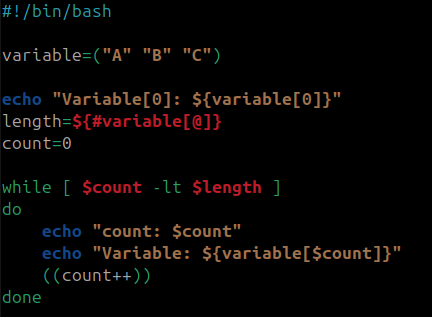
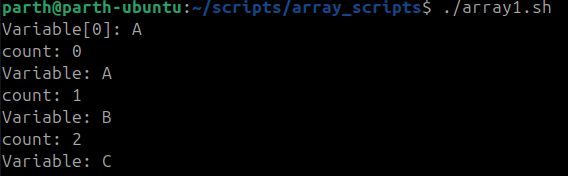
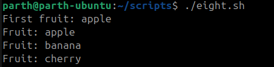
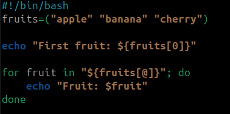
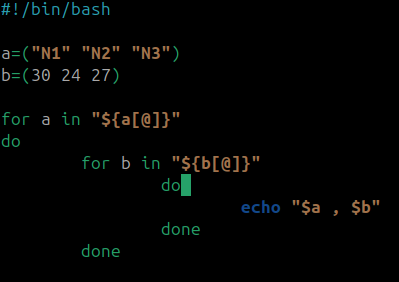
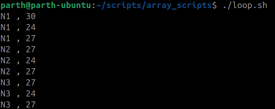

# Shell Scripting
# 🔹 1. **Print variables using while loop**

### Example :

```bash
#!/bin/bash

variable=("A" "B" "C")

echo "Variable[0]: ${variable[0]}"
length=${#variable[@]}
count=0

while [ $count -lt $length ]
do
    echo "count: $count"
    echo "Variable: ${variable[$count]}"
    ((count++))
done

```



Output-




---
# 🔹 2. **Print variables using for loop**

### Example :


```bash
fruits=("apple" "banana" "cherry")

echo "First fruit: ${fruits[0]}"

for fruit in "${fruits[@]}"; do
    echo "Fruit: $fruit"
done
```



Output-



---

# 🔹 3. **Print combinations of two arrays using nested for loops**


### Example :


```bash
#!/bin/bash

a=("N1" "N2" "N3")
b=(30 24 27)

for a_val in "${a[@]}"
do
    for b_val in "${b[@]}"
    do
        echo "$a_val , $b_val"
    done
done

```




Output-


