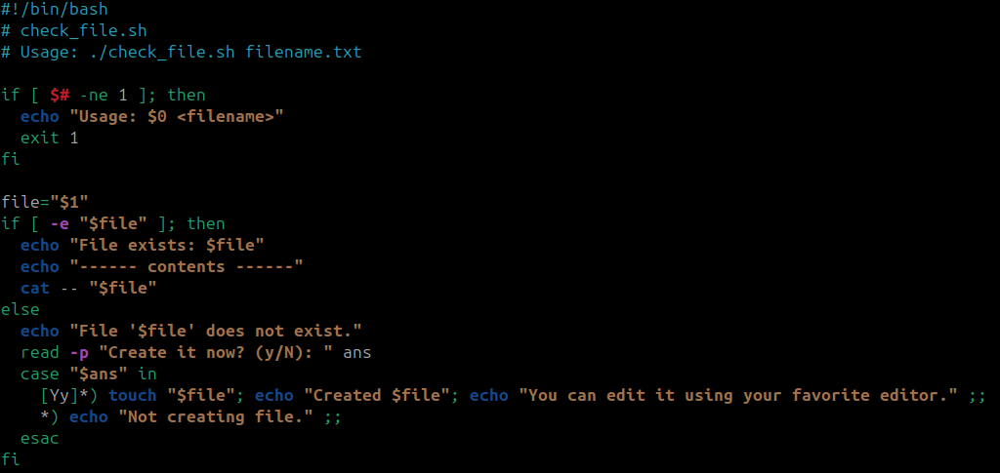
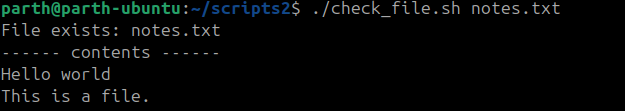
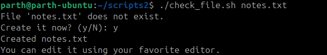
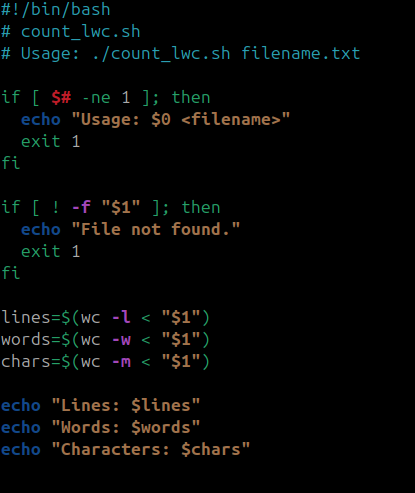
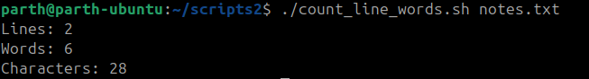
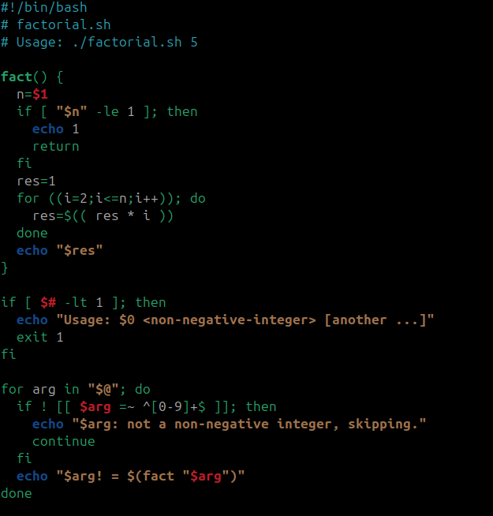
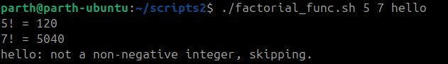
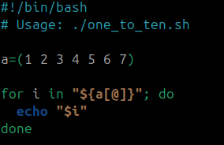
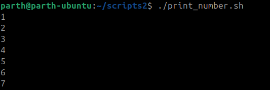

# Bash Script Explanations

## 1. `check_file.sh`

### Code

``` bash
#!/bin/bash
# check_file.sh
# Usage: ./check_file.sh filename.txt

if [ $# -ne 1 ]; then
  echo "Usage: $0 <filename>"
  exit 1
fi

file="$1"
if [ -e "$file" ]; then
  echo "File exists: $file"
  echo "------ contents ------"
  cat -- "$file"
else
  echo "File '$file' does not exist."
  read -p "Create it now? (y/N): " ans
  case "$ans" in
    [Yy]*) touch "$file"; echo "Created $file"; echo "You can edit it using your favorite editor." ;;
    *) echo "Not creating file." ;;
  esac
fi
```



### Explanation

-   Checks if exactly one argument is provided (`$# -ne 1`).\
-   If the file exists (`-e`), it prints its contents using `cat`.\
-   If not, it asks the user whether to create it (`read -p`).\
-   If the user answers `y` or `Y`, `touch` creates the file.

### Example

``` bash
./check_file.sh notes.txt
```

### Output

If `notes.txt` exists:

    File exists: notes.txt
    ------ contents ------
    Hello world
    This is a file.



If it does not exist:

    File 'notes.txt' does not exist.
    Create it now? (y/N): y
    Created notes.txt
    You can edit it using your favorite editor.



------------------------------------------------------------------------

## 2. `count_lines_words.sh`

### Code

``` bash
#!/bin/bash
# count_lwc.sh
# Usage: ./count_lwc.sh filename.txt

if [ $# -ne 1 ]; then
  echo "Usage: $0 <filename>"
  exit 1
fi

if [ ! -f "$1" ]; then
  echo "File not found."
  exit 1
fi

lines=$(wc -l < "$1")
words=$(wc -w < "$1")
chars=$(wc -m < "$1")

echo "Lines: $lines"
echo "Words: $words"
echo "Characters: $chars"
```



### Explanation

-   Checks if the file exists (`-f`).\
-   Uses `wc` (word count tool):
    -   `wc -l` → counts lines\
    -   `wc -w` → counts words\
    -   `wc -m` → counts characters\
-   Stores results in variables and prints them.

### Example

``` bash
./count_lines_words.sh notes.txt
```

### Output

    Lines: 2
    Words: 6
    Characters: 28



------------------------------------------------------------------------

## 3. `factorial_func.sh`

### Code

``` bash
#!/bin/bash
# factorial.sh
# Usage: ./factorial.sh 5

fact() {
  n=$1
  if [ "$n" -le 1 ]; then
    echo 1
    return
  fi
  res=1
  for ((i=2;i<=n;i++)); do
    res=$(( res * i ))
  done
  echo "$res"
}

if [ $# -lt 1 ]; then
  echo "Usage: $0 <non-negative-integer> [another ...]"
  exit 1
fi

for arg in "$@"; do
  if ! [[ $arg =~ ^[0-9]+$ ]]; then
    echo "$arg: not a non-negative integer, skipping."
    continue
  fi
  echo "$arg! = $(fact "$arg")"
done
```



### Explanation

-   Defines a **function** `fact()` to calculate factorial.\
-   Uses a `for` loop to multiply numbers from 2 to `n`.\
-   Accepts multiple arguments (`$@`).\
-   Skips invalid inputs (non-numbers).

### Example

``` bash
./factorial_func.sh 5 7 hello
```

### Output

    5! = 120
    7! = 5040
    hello: not a non-negative integer, skipping.




------------------------------------------------------------------------

## 4. `print_number.sh`

### Code

``` bash
#!/bin/bash
# Usage: ./one_to_ten.sh

a=(1 2 3 4 5 6 7)

for i in "${a[@]}"; do
  echo "$i"
done
```



### Explanation

-   Defines an array `a=(1 2 3 4 5 6 7)`.\
-   Loops through the array and prints each element.\
-   Demonstrates how arrays work in bash.

### Example

``` bash
./print_number.sh
```

### Output

    1
    2
    3
    4
    5
    6
    7


